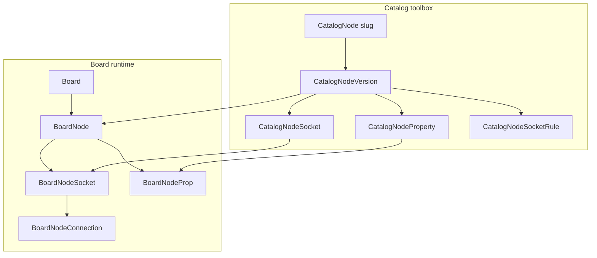
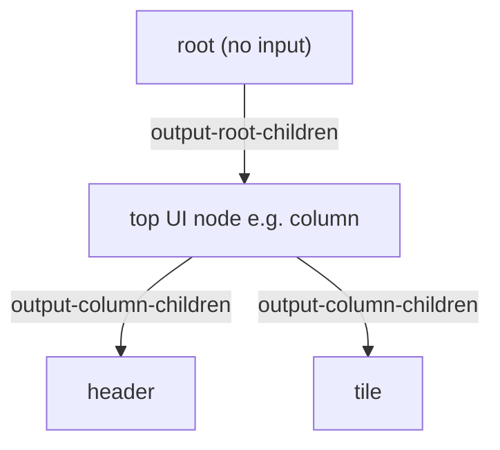
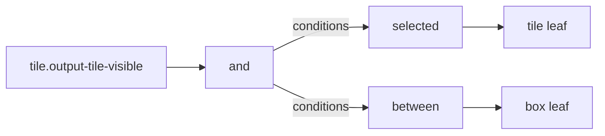
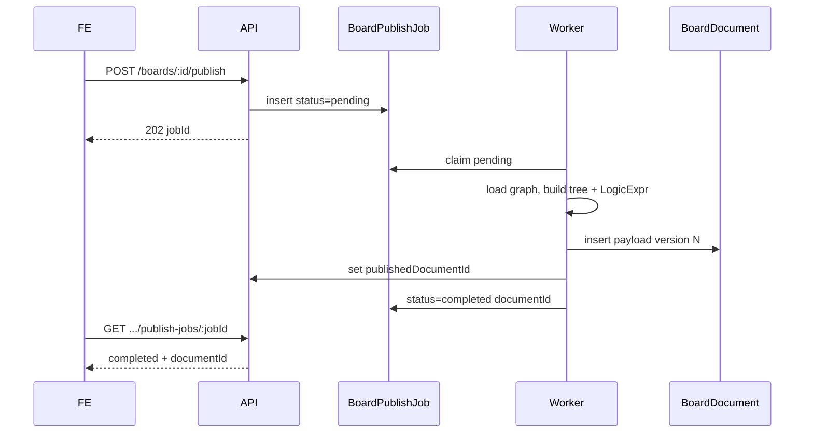
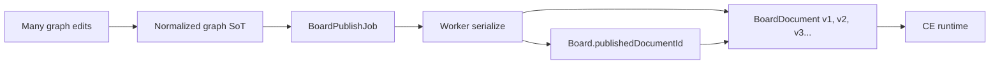

# Board document: graph → tree → JSON

Design for materializing a whiteboard graph into a nested UI tree and a versioned JSON document for CE (and other runtimes).

Related:

- [DB schema](./db.md) — normalized graph (source of truth while editing)
- Catalog CSVs: [nodes](./catalog/nodes.csv), [sockets](./catalog/sockets.csv), [sockets-matrix](./catalog/sockets-matrix.csv), [props](./catalog/props.csv)
- [API](../api/api.md) — publish / document endpoints (to be added)

---

## Goals

- Keep the **normalized board graph** as the edit-time source of truth.
- Derive a **UI tree** (root on top, parent → children) without a `parentId` column.
- Publish an immutable **JSON document** that CE can evaluate (`isVisible` / `isEnabled` as logic definitions, not booleans).
- Allow many graph edits without writing a document on every change.

---

## What already works

- Catalog version pin on each placed node.
- Mirrored `BoardNodeSocket` + `BoardNodeConnection` for the free-form graph.
- `Board.snap` — presentation only (viewport / Vue Flow layout).
- Props from `props.csv` → `CatalogNodeProperty` / `BoardNodeProp`.
- Containment, logic, and UI control via sockets (`sockets.csv` / `sockets-matrix.csv`).



---

## UI tree (no `parentId`)

Derive the tree from the connection graph.

### Catalog type: `root`

| Field | Value |
| ----- | ----- |
| Slug | `root` |
| Inputs | none |
| Outputs | one: `output-root-children` with **limit 1** |
| Props | none (marker only) |
| Allowed targets | UI `input-*-id` (same set as container children targets per matrix) |
| Board rule | **Exactly one** placed `root` node per board |



| Role | Mechanism |
| ---- | --------- |
| Tree entry | Unique `root` → `output-root-children` → one child `input-*-id` |
| Parent → children | Container `output-*-children` → child `input-*-id` |
| Sibling order | `BoardNodeConnection.order` on children edges |
| Visibility / enabled | Logic on `output-*-visible` / `output-*-enabled` → compiled into expression objects |
| Failure | Missing/extra `root`, or root output disconnected → invalid document |

The nested JSON `tree` starts at the UI node linked from `root`. The `root` marker is omitted from the tree. Logic nodes are not tree children; they appear only inside `isVisible` / `isEnabled`.

### Catalog CSV impact

- Add `root` to `nodes.csv`
- Add `output-root-children` to `sockets.csv`
- Extend `sockets-matrix.csv` and regenerate `rules.csv`
- No `props.csv` rows for `root`

---

## `isVisible` / `isEnabled`: LogicExpr (not props, not booleans)

`props.csv` stays authoring/config only. Visibility and enabled stay **output sockets** on UI nodes. In the published document they become **logic definitions**:

- Walk connections on `output-*-visible` / `output-*-enabled`.
- Compile the logic subgraph into a **`LogicExpr`**.
- Nothing wired → `null` (always visible / always enabled).
- Do **not** store evaluated booleans; CE evaluates with live context (selection, box values, …).

### LogicExpr AST

Discriminated by `op` (catalog slug). Operand order follows `BoardNodeConnection.order` when a node has multiple condition edges.

```ts
type LogicExpr =
  | null // no wiring → always true
  | { op: "and"; nodeId: number; args: LogicExpr[] }
  | { op: "or"; nodeId: number; args: LogicExpr[] }
  | { op: "not"; nodeId: number; arg: LogicExpr }
  | { op: "between"; nodeId: number; boxNodeId: number }
  | { op: "selected"; nodeId: number; tileNodeId: number };
```

| `op` | Built from the graph |
| ---- | -------------------- |
| `and` / `or` | That logic node; `args` from `output-and-conditions` / `output-or-conditions` |
| `not` | Single `arg` from `output-not-condition` |
| `between` | Leaf: `boxNodeId` via `output-between-box` → `input-box-id` |
| `selected` | Leaf: `tileNodeId` via `output-selected-tile` → `input-tile-id` |

UI outputs for visible/enabled already have **limit 1** — prefer exactly one driver connection into each.



Example:

```json
{
  "op": "and",
  "nodeId": 20,
  "args": [
    { "op": "selected", "nodeId": 21, "tileNodeId": 5 },
    { "op": "between", "nodeId": 22, "boxNodeId": 8 }
  ]
}
```

---

## Document payload shape

Two layers in one JSON object:

1. **Flat graph dump** — nodes, sockets, connections, props.
2. **Derived UI tree** — nested children; each node has `props` plus `isVisible` / `isEnabled` as `LogicExpr`.

```json
{
  "board": { "id": 1, "name": "..." },
  "nodes": [],
  "connections": [],
  "tree": {
    "id": 10,
    "slug": "column",
    "props": { "type": "..." },
    "isVisible": null,
    "isEnabled": {
      "op": "or",
      "nodeId": 30,
      "args": [
        { "op": "selected", "nodeId": 31, "tileNodeId": 5 },
        {
          "op": "not",
          "nodeId": 32,
          "arg": { "op": "between", "nodeId": 33, "boxNodeId": 8 }
        }
      ]
    },
    "children": [
      {
        "id": 11,
        "slug": "tile",
        "props": { "value": "x", "property": "y" },
        "isVisible": {
          "op": "and",
          "nodeId": 20,
          "args": [{ "op": "selected", "nodeId": 21, "tileNodeId": 5 }]
        },
        "isEnabled": null,
        "children": []
      }
    ]
  }
}
```

- Flat `nodes` / `connections` still include logic nodes (and `root`) for fidelity / debugging.
- Nested `tree` embeds compiled logic; CE does not re-walk the board graph at runtime.

---

## When is the document generated? Versioning

Graph edits do **not** write a document. Documents are **published snapshots**.

| Event | What happens |
| ----- | ------------ |
| Place/move/connect, edit props, save `snap` | Update normalized graph (+ optional `snap`) only. **No document write.** |
| **Publish** | Enqueue async job → worker serializes graph → insert immutable `BoardDocument` → set `Board.publishedDocumentId` |
| CE / consumers | Read the **published** document (by board’s active pointer or by version id). |
| Preview (optional) | Compute in memory from the draft graph; do not persist (and do not block on publish). |

Do **not** overwrite a single jsonb on `Board` (loses history; couples editing to CE).

### Publish is async — not a long sync HTTP request

Serialize + LogicExpr compile can be slow on large boards. There is **no job queue in the BE today**, so avoid adding Redis/Bull for v1.

**Pattern:** HTTP **202 Accepted** + **Postgres-backed job row** + in-process (or scheduled) worker.



| Piece | Choice |
| ----- | ------ |
| Kickoff | `POST /boards/:id/publish` → create job, return **202** + `{ jobId }` (never wait for full serialize) |
| Job store | New entity **`BoardPublishJob`** in Postgres (no Redis) |
| Worker | NestJS background processor claiming `pending` jobs (poll interval or `FOR UPDATE SKIP LOCKED`); retries with backoff |
| Progress | Job statuses: `pending` → `running` → `completed` \| `failed` |
| Concurrency | **At most one active publish per board** (reject or queue-behind if `pending`/`running` already exists) |
| Consistency (v1) | Worker serializes the **current** graph at run time; FE should avoid editing mid-publish (disable canvas while job running) |
| Consistency (later) | Optional `graphRevision` / `Board.graphVersion` captured at enqueue for stale detection |
| FE UX | Poll `GET /boards/:id/publish-jobs/:jobId` (or list latest); show progress; on `completed` refresh published version |
| Preview | Keep **sync in-memory** preview separate (optional, timeout-bounded); must not share the publish job path |

Do **not** use a long-lived sync `POST` that holds the HTTP connection for the full serialize (gateway timeouts, poor UX). Optional later: Redis/Bull or websockets for push — not required for v1.

### Entity: `BoardPublishJob`

| Field | Type | Notes |
| ----- | ---- | ----- |
| `id` | bigint | PK / jobId returned to FE |
| `boardId` | bigint | FK → `Board` |
| `status` | enum | `pending` \| `running` \| `completed` \| `failed` |
| `boardDocumentId` | bigint, nullable | Set on success → new `BoardDocument` |
| `error` | text, nullable | Failure message for FE |
| `attemptCount` | int | Retries |
| `createdAt` / `startedAt` / `finishedAt` | timestamptz | |
| `createdById` | bigint, nullable | Who clicked publish |

### Entity: `BoardDocument` (append-only)



**`BoardDocument`**

| Field | Type | Notes |
| ----- | ---- | ----- |
| `id` | bigint | PK |
| `boardId` | bigint | FK → `Board` |
| `version` | int | Monotonic per board (`1`, `2`, …) |
| `payload` | jsonb | Full document (`nodes` + `connections` + `tree`) |
| `createdAt` | timestamptz | Publish time |
| `createdById` | bigint, nullable | Who published |

**Unique:** `(boardId, version)`. Prefer **never mutate `payload`**.

**`Board` additions**

| Field | Type | Notes |
| ----- | ---- | ----- |
| `publishedDocumentId` | bigint, nullable | FK → live `BoardDocument`. Null = never published. |
| `snap` | jsonb | Unchanged — FE presentation only |

- Each successful job **inserts** a new `BoardDocument` row; rollback = point `publishedDocumentId` at an older version.
- Draft graph may diverge from the last published document until the next successful publish.
- No filesystem file for the product path; a downloadable `.json` can export `BoardDocument.payload`.

---

## Follow-ups (implementation)

1. Align [`db.md`](./db.md) naming/examples with code (`BoardNode*`, cross-type rules, `string`/`number` props).
2. Seed catalog `root` (CSV + matrix/rules).
3. Migration: `BoardDocument` + `BoardPublishJob` + `Board.publishedDocumentId`.
4. Serializer worker + publish API (`202` + job poll); CE reads published payload and evaluates `LogicExpr`.
