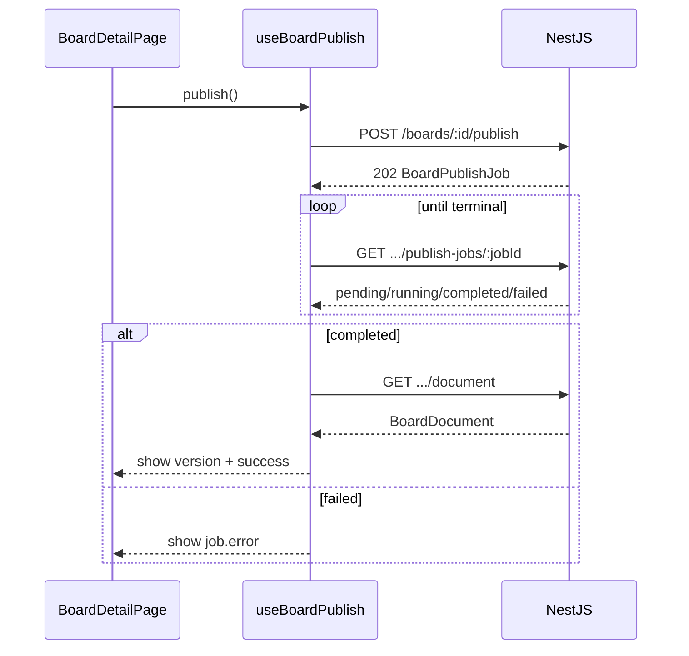

# Board document — FE next steps

How to wire the frontend to the **async publish / board document** feature that already exists on the BE.

Related:

- [BE board document design](../../be/doc/db/board-document.md) — `root`, `LogicExpr`, `BoardDocument`, `BoardPublishJob`
- [BE API](../../be/doc/api/api.md) — publish routes
- [FE services & sync](./service/service.md) — HTTP client, codegen, board-graph services
- [Pages & routing](./layout/pages.md) — `BoardDetailPage` patterns

---

## Current FE state (what already works)

| Area | Status |
| ---- | ------ |
| Board list / create / soft-delete | Done (`BoardPage`, `boardsService`) |
| Board canvas (Vue Flow) | Done (`useBoardGraph`, place/remove nodes, connections) |
| Toolbox from catalog | Done (`NodesCatalog`) — will pick up `root` after catalog seed + reload |
| Node props editor | Done (`BoardNodePropsForm`) |
| `Board.snap` persist | Done (presentation only; not the published document) |
| Publish / documents / jobs | Done (`useBoardPublish`, Publish + Versions on `BoardDetailPage`) |
| `root` icon / UX hints | Done (`CatalogNodeIcon` includes `root`) |
| OpenAPI types for publish | Done (`BoardDocument`, `BoardPublishJob`) |

Edit-time **source of truth** stays the normalized graph APIs (nodes, connections, props) per [service.md](./service/service.md). Publish produces an immutable **derived** payload for CE — do not write the tree into `snap`.

---

## Goal for this FE feature

On the board detail screen, let an author:

1. Ensure the graph has exactly one catalog **`root`** node wired to a top UI node.
2. Click **Publish** → `POST /boards/:boardId/publish` → poll job until `completed` / `failed`.
3. See published version info (and optionally browse history / open payload).

CE consuming/evaluating `LogicExpr` is **out of scope** for FE (that is the CE app).

---

## BE contract (already live)

| Method | Path | Notes |
| ------ | ---- | ----- |
| `POST` | `/boards/:boardId/publish` | **`202`** + `BoardPublishJob` |
| `GET` | `/boards/:boardId/publish-jobs` | Recent jobs |
| `GET` | `/boards/:boardId/publish-jobs/:jobId` | Poll status |
| `GET` | `/boards/:boardId/document` | Live published `BoardDocument` (`payload`) |
| `GET` | `/boards/:boardId/documents` | Version list |
| `GET` | `/boards/:boardId/documents/:documentId` | One version |

Job statuses: `pending` → `running` → `completed` \| `failed`. At most **one active** publish per board (`409` if another is running).

`Board.publishedDocumentId` is set on success; `BoardDocument.payload` holds `{ board, nodes, connections, tree }` with `isVisible` / `isEnabled` as `LogicExpr` (or `null`).

---

## Implementation plan (ordered)

### 1. Regenerate OpenAPI types

```bash
# apps/be
yarn export:openapi

# apps/fe
yarn codegen:api
```

Add aliases in `src/api/types.ts` (names may match generated schemas):

- `BoardDocument`, `BoardPublishJob`
- Ensure `Board` includes `publishedDocumentId`

Follow the codegen workflow in [service.md](./service/service.md).

### 2. New board-graph services

Add under `src/services/board-graph/` (same style as `boards.service.ts`):

| Export | Methods |
| ------ | ------- |
| `boardDocumentsService` | `getPublished(boardId)`, `list(boardId)`, `findOne(boardId, documentId)` |
| `boardPublishService` | `enqueue(boardId)` → expects **202**, `listJobs(boardId)`, `getJob(boardId, jobId)` |

Notes:

- IDs remain **strings** (bigint-safe).
- `enqueue` must not treat 202 as an error — extend `api/client.ts` if needed so 202 parses JSON like 200.
- Re-export from `board-graph/index.ts`.
- Update the service inventory table in [service.md](./service/service.md) when these land.

### 3. Composable: `useBoardPublish`

Suggested location: `src/views/board/composables/useBoardPublish.ts`.

Responsibilities:

1. `publish()` → `enqueue` → store `jobId`.
2. Poll `getJob` every ~1–2s until `completed` / `failed` (clear interval on unmount).
3. Expose: `status`, `error`, `isPublishing`, `lastDocument` (reload via `getPublished` on success).
4. On `409 Conflict`, surface “publish already in progress” and optionally attach to the active job from `listJobs`.

Optional UX: while `isPublishing`, disable further publish and show a spinner on the toolbar (v1 may still allow graph edits; BE serializes graph at worker run time).

### 4. UI on `BoardDetailPage`

Per [pages.md](./layout/pages.md), keep chrome in `PageHeader` / a thin toolbar next to the canvas:

| Control | Behavior |
| ------- | -------- |
| **Publish** button | Calls `useBoardPublish.publish()` |
| Job status text | `Publishing…` / `Published vN` / error message from `job.error` |
| **Versions** (optional v1) | Dialog or side panel listing `documents`; select → show `payload.tree` JSON preview |

Do **not** put publish into `snap` saves (`useBoardGraph` stays presentation-only).

### 5. Catalog / canvas support for `root`

| Task | Detail |
| ---- | ------ |
| Icon | Add `root` to `CatalogNodeIcon.vue` (e.g. `GitCommitHorizontal` / `CircleDot`) |
| Toolbox | No special case if catalog seed includes `root` — it appears like other nodes |
| Soft validation (FE) | Before publish, optionally warn if zero/multiple `root` nodes or root output disconnected (BE will still fail the job with a clear `error`) |
| Connection rules | Already enforced by existing catalog socket-rule validation on the canvas |

### 6. Tests (minimal)

- Service unit/mocks: `enqueue` handles 202; poll stops on `completed` / `failed`.
- Optional: composable poll with fake timers.

---

## Suggested sequence diagram



---

## Out of scope (later)

- CE `LogicExpr` evaluation / `MenuNode` migration.
- WebSocket push for job completion (polling is enough for v1).
- Editing graph while publishing with optimistic locking / graph revision.
- Aggregate `GET /boards/:id/graph` (still deferred per service.md).

---

## Done when

- [x] OpenAPI regenerated; FE types include publish/document schemas
- [x] `boardDocumentsService` + `boardPublishService` exported
- [x] Publish button on board detail polls to completion and shows errors
- [x] Published version visible after success (`publishedDocumentId` / document payload)
- [x] `root` has a toolbox icon; publish failure messages readable when root is missing
