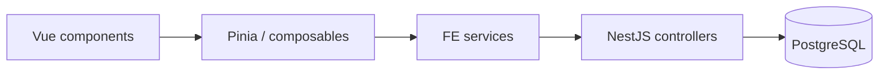

# Frontend services & BE sync

Instructions for wiring the Vue frontend to the NestJS backend: mirror every BE resource with a typed FE service.

## Goals

- **Single source of truth:** normalized graph and catalog live in PostgreSQL via the BE ([`apps/be/doc/db/db.md`](../../../be/doc/db/db.md)).
- **Thin HTTP layer:** FE services map to BE resources; no business rules duplicated on the client unless required for UX (validation hints, formatting).
- **Stable contracts:** types and method names follow **domain entities** (`CatalogNode`, …) and OpenAPI at `http://localhost:3000/docs` (JSON: `/docs/json`).
- **bigint-safe:** all entity IDs are `bigint` in the DB and serialized as **strings** in JSON. Never use `number` for IDs in TS.

## BE modules → FE services

| BE module     | Domain                                     | FE folder (proposed)        |
| ------------- | ------------------------------------------ | --------------------------- |
| `catalog`     | Global toolbox (`CatalogNode` and related) | `src/services/catalog/`     |
| `board-graph` | Per-board runtime graph                    | `src/services/board-graph/` |

Each resource gets one **FE service** with create / get-by-id / update / delete on a **flat CRUD path**, plus **list** methods that call the correct nested or top-level list route (see below).

### Service inventory (catalog)

| #   | FE service                      | Entity                  | List (`GET`, paginated)                                         | CRUD (`POST` / `GET :id` / `PATCH` / `DELETE`) |
| --- | ------------------------------- | ----------------------- | --------------------------------------------------------------- | ---------------------------------------------- |
| 1   | `catalogNodesService`           | `CatalogNode`           | `GET /catalog-nodes`                                            | `/catalog-nodes`                               |
| 2   | `catalogNodeVersionsService`    | `CatalogNodeVersion`    | `GET /catalog-nodes/:catalogNodeId/versions`                    | `/catalog-node-versions`                       |
| 3   | `catalogNodeSocketsService`     | `CatalogNodeSocket`     | `GET /catalog-node-versions/:catalogNodeVersionId/sockets`      | `/catalog-node-sockets`                        |
| 4   | `catalogNodeSocketRulesService` | `CatalogNodeSocketRule` | `GET /catalog-node-versions/:catalogNodeVersionId/socket-rules` | `/catalog-node-socket-rules`                   |
| 5   | `catalogNodePropertiesService`  | `CatalogNodeProperty`   | `GET /catalog-node-versions/:catalogNodeVersionId/properties`   | `/catalog-node-properties`                     |

There is **no** global `GET /catalog-node-versions` — versions are always listed under a `catalogNodeId`. Same for sockets, rules, and properties: lists are scoped to a **catalog node version**.

### Service inventory (board graph)

| #   | FE service                    | Entity                | List (`GET`, paginated)            | CRUD                      |
| --- | ----------------------------- | --------------------- | ---------------------------------- | ------------------------- |
| 6   | `boardsService`               | `Board`               | `GET /boards`                      | `/boards`                 |
| 7   | `boardNodesService`           | `BoardNode`           | `GET /boards/:boardId/nodes`       | `/board-nodes`            |
| 8   | `boardNodeConnectionsService` | `BoardNodeConnection` | `GET /boards/:boardId/connections` | `/board-node-connections` |
| 9   | `boardNodePropsService`       | `BoardNodeProp`       | `GET /boards/:boardId/props`       | `/board-node-props`       |

Board-scoped lists take `boardId` from the URL path, not a `?boardId=` query param.

### `BoardNodeSocket` (no standalone REST resource)

Runtime sockets are **created on the BE** when a node is placed (`POST /board-nodes`). There is no `GET /board-node-sockets` collection.

| Concern                    | Approach                                                                                                                        |
| -------------------------- | ------------------------------------------------------------------------------------------------------------------------------- |
| **Read for canvas**        | `GET /boards/:boardId/nodes?include=sockets` (and optionally `catalogNodeVersion`) — always load sockets with their parent node |
| **Write**                  | Implicit via node placement; connection rules validated on the BE                                                               |
| **Standalone socket list** | Not used — no FE service for sockets-only fetch                                                                                 |

## API shape: lists vs CRUD

The BE uses **two controller styles** per resource family:

1. **Collection list** — one `GET` returning `{ data, meta }`, often on a **nested** path (parent id in the URL).
2. **Entity CRUD** — flat kebab-case resource path (`/board-nodes`, `/catalog-node-versions`, …) with `POST`, `GET :id`, `PATCH :id`, `DELETE :id`. No `GET` collection on these controllers.

| Operation    | Typical path pattern                             | Response                          |
| ------------ | ------------------------------------------------ | --------------------------------- |
| `POST`       | `/resource`                                      | Single entity                     |
| `GET` (list) | `/parent/:parentId/children` or `/catalog-nodes` | `PaginatedResult<T>`              |
| `GET` (one)  | `/resource/:id`                                  | Single entity                     |
| `PATCH`      | `/resource/:id`                                  | Single entity                     |
| `DELETE`     | `/resource/:id`                                  | **`204 No Content`** (empty body) |

The HTTP client must treat **`204`** as success with **no JSON body** (`delete` resolves to `void`).

Deletion semantics differ by domain (see db.md): boards and board graph rows use **soft delete**; catalog versions use **deprecation** (`deprecatedAt` / `isActive`) on `DELETE /catalog-node-versions/:id`.

## Pagination & list query params

All list endpoints return the same envelope (see `apps/be/src/common/pagination/index.ts`):

```ts
interface PaginatedMeta {
  page: number;
  pageSize: number;
  total: number;
  totalPages: number;
}

interface PaginatedResult<T> {
  data: T[];
  meta: PaginatedMeta;
}
```

**Query parameters** (shared base: `PaginationQueryDto`):

| Param       | Default | Notes                                                |
| ----------- | ------- | ---------------------------------------------------- |
| `page`      | `1`     | 1-based                                              |
| `pageSize`  | `20`    | max `100`                                            |
| `sortBy`    | —       | Resource-specific whitelist; invalid values → `400`  |
| `sortOrder` | `ASC`   | `ASC` \| `DESC`                                      |
| `q`         | —       | Full-text search on whitelisted columns per endpoint |

**Resource-specific filters** (append to the same query string):

| List endpoint                                | Extra query params                                                                    |
| -------------------------------------------- | ------------------------------------------------------------------------------------- |
| `GET /catalog-nodes/:catalogNodeId/versions` | `isActive`, `includeDeprecated` (booleans, send as `true` / `false` strings)          |
| `GET /catalog-node-versions/:id/sockets`     | `type` = `input` \| `output`                                                          |
| `GET /catalog-node-versions/:id/properties`  | `type`, `isRequired`                                                                  |
| `GET /boards/:boardId/nodes`                 | `catalogNodeVersionId`, `include` = comma-separated (`sockets`, `catalogNodeVersion`) |
| `GET /boards/:boardId/connections`           | `fromNodeSocketId`, `toNodeSocketId`                                                  |
| `GET /boards/:boardId/props`                 | `nodeId`, `catalogNodePropertyId`                                                     |

Sort whitelists are defined next to each list DTO under `apps/be/src/modules/**/dto/list-*.dto.ts` (e.g. board nodes: `id`, `createdAt`).

### FE pagination patterns

- **Single page:** pass `page` / `pageSize` through from the UI or store.
- **Load everything (admin / large graph sync):** loop until `meta.page >= meta.totalPages` (or `data.length === 0`), with a sane max page guard in dev.
- **Do not** assume list endpoints return a bare `T[]` — always type list calls as `PaginatedResult<T>`.

Put shared types in `api/types.ts` (`PaginatedResult`, `PaginationQuery`, `ListXQuery` per resource). Optional helper:

```ts
// api/pagination.ts (illustrative)
export async function fetchAllPages<T>(
  fetchPage: (page: number) => Promise<PaginatedResult<T>>,
  maxPages = 50,
): Promise<T[]> {
  const out: T[] = [];
  let page = 1;
  for (;;) {
    const { data, meta } = await fetchPage(page);
    out.push(...data);
    if (page >= meta.totalPages || data.length === 0) break;
    if (++page > maxPages) throw new Error("fetchAllPages: exceeded maxPages");
  }
  return out;
}
```

## Types: OpenAPI codegen (BE as source of truth)

**Decision:** generate TypeScript from the committed OpenAPI spec; keep **hand-written** `api/client.ts` and `services/*`.

| Generated                                               | Hand-written                                            |
| ------------------------------------------------------- | ------------------------------------------------------- |
| `src/api/generated/schema.d.ts` (`paths`, `components`) | `api/client.ts`, `api/pagination.ts`, `services/**`     |
| Request/query types from DTOs                           | Thin aliases (`Board`, `CreateBoard`) in `api/types.ts` |
|                                                         | UI-only types under `src/types/ui/` if needed           |

**Tool:** [`openapi-typescript`](https://github.com/drwpow/openapi-typescript) (types only — no Orval/client generator).

**Spec file:** `apps/be/openapi.json`, exported from Nest (same document as `/docs/json`), committed or regenerated in CI before FE codegen.

```json
// apps/fe/package.json (scripts)
{
  "codegen:api": "openapi-typescript ../be/openapi.json -o ./src/api/generated/schema.d.ts"
}
```

```ts
// api/types.ts (illustrative)
import type { components } from "./generated/schema";

export type Board = components["schemas"]["Board"];
export type CreateBoard = components["schemas"]["CreateBoardDto"];
export type PaginatedMeta = components["schemas"]["PaginatedMetaDto"];
```

**Workflow:** BE Swagger/DTO change → `export:openapi` → `codegen:api` → fix service compile errors.

**BE prerequisite for rich types:** document response schemas (`@ApiOkResponse`, response DTOs, optional Nest Swagger plugin). Until then, codegen covers **paths and inputs** well; entity/response shapes may stay as hand aliases mirroring `apps/be/src/entities/`.

## HTTP client: fetch vs libraries

`apps/fe/package.json` has **no** HTTP client dependency (no Axios, ky, ofetch).

| Layer                        | Approach                                                                                                                            |
| ---------------------------- | ----------------------------------------------------------------------------------------------------------------------------------- |
| `api/client.ts`              | Thin wrapper around **`fetch`** (native, works in Vitest with global `fetch` / jsdom)                                               |
| Services                     | Call `api.get/post/patch/delete`; no caching                                                                                        |
| Composables / stores (later) | Optional **`useFetch`** from `@vueuse/core` (already a dependency) for component-level loading state — not required inside services |

Why native `fetch`:

- Zero extra bundle size; aligns with Vue 3 + Vite defaults.
- Easy to mock in Vitest (`vi.stubGlobal('fetch', …)`).
- Full control over error shape and bigint-safe JSON parsing.

**Avoid** adding Axios/ky unless you need interceptors, upload progress, or cancel tokens at scale.

### `api/client.ts` sketch

- Base URL: `import.meta.env.VITE_API_URL` (default `http://localhost:3000`).
- `Content-Type: application/json` on mutating requests.
- `buildUrl(path, query?)` — use `URLSearchParams`; omit undefined query keys.
- Parse JSON on success; on non-2xx, throw `ApiError` with `status`, `message`, optional Nest validation payload (`message: string[]`).
- **`delete`:** expect **`204`**, do not call `response.json()`.
- **Auth (upcoming):** reserve an interceptor hook (e.g. `getAuthHeaders()`) for when the user module lands; services stay unchanged.
- No global state in the client.

Optional for local dev: Vite proxy in `vite.config.ts` so the browser calls `/api/...` and avoids CORS.

## Board load & canvas (no aggregate endpoint)

**Decision:** no `GET /boards/:id/graph` aggregate for now. Use existing endpoints.

Per [db.md](../../../be/doc/db/db.md), **`Board.snap`** is **presentation-only** (viewport, node positions on canvas, FE layout state). **Graph truth** remains normalized: `board-nodes`, `board-node-connections`, `board-node-props`.

### Opening a board (canvas)

```mermaid
sequenceDiagram
  participant Store as Board store
  participant API as NestJS

  Store->>API: GET /boards/:id
  Note over Store: Apply snap → first paint (viewport + layout)
  par When graph semantics needed
    Store->>API: GET /boards/:id/nodes?include=sockets,catalogNodeVersion
    Store->>API: GET /boards/:boardId/connections
    Store->>API: GET /boards/:boardId/props
  end
  Note over Store: Merge into normalized store; keep snap in sync on write
```

| Step | Call                                                                                          | Purpose                                                                    |
| ---- | --------------------------------------------------------------------------------------------- | -------------------------------------------------------------------------- |
| 1    | `boardsService.findOne(boardId)`                                                              | `name`, **`snap`** — drive canvas visualization (pan/zoom, node positions) |
| 2a   | `boardNodesService.listByBoard(id, { include: 'sockets,catalogNodeVersion', pageSize: 100 })` | Nodes + runtime sockets for edges and catalog refs                         |
| 2b   | `boardNodeConnectionsService.listByBoard(id, { pageSize: 100 })`                              | Edges (socket id → socket id)                                              |
| 2c   | `boardNodePropsService.listByBoard(id, { pageSize: 100 })`                                    | Runtime property values                                                    |

- Run **step 1 first** so the UI can render from `snap` immediately.
- Run **2a–2c in parallel** when the editor needs connections, validation, or snap/graph reconciliation; use `fetchAllPages` if `meta.totalPages > 1`.
- Commit normalized graph to the store only when required slices have succeeded (define policy for partial failure).
- On graph mutations, update both **normalized rows** (via CRUD services) and **`snap`** (via `PATCH /boards/:id`) so presentation stays consistent with db.md.

**Deferred:** a single aggregate read endpoint only if profiling shows pain (very large boards, strict multi-user snapshot consistency).

## Proposed FE layout

```
apps/fe/src/
  api/
    client.ts
    types.ts              # aliases + shared helpers
    pagination.ts         # fetchAllPages
    generated/
      schema.d.ts         # openapi-typescript — do not edit
  services/
    catalog/
      ...
    board-graph/
      boards.service.ts
      board-nodes.service.ts
      board-node-connections.service.ts
      board-node-props.service.ts
      index.ts
```

Naming: **kebab-case files**, **camelCase exports** (`catalogNodesService`), **PascalCase types** (`CatalogNode`, `CreateCatalogNode`).

## Create / update payloads

Mirror **entities** and DTO field names (codegen `Create*Dto` → alias `Create*` in `api/types.ts`):

| Create payload (FE)           | Main fields                                                                |
| ----------------------------- | -------------------------------------------------------------------------- |
| `CreateCatalogNode`           | `slug`                                                                     |
| `CreateCatalogNodeVersion`    | `catalogNodeId`, `version`, `name`, `isActive?`, `deprecatedAt?`           |
| `CreateCatalogNodeSocket`     | `catalogNodeVersionId`, `type: 'input' \| 'output'`, `name`, `limit?`      |
| `CreateCatalogNodeSocketRule` | `catalogNodeVersionId`, `catalogNodeSocketFromId`, `catalogNodeSocketToId` |
| `CreateCatalogNodeProperty`   | `catalogNodeVersionId`, `type`, `defaultValue?`, `isRequired?`             |

Board graph:

| Create payload (FE)         | Main fields                                               |
| --------------------------- | --------------------------------------------------------- |
| `CreateBoard`               | `name`, `snap?`                                           |
| `CreateBoardNode`           | `boardId`, `catalogNodeVersionId`, `value?`               |
| `CreateBoardNodeConnection` | `boardId`, `fromNodeSocketId`, `toNodeSocketId`, `order?` |
| `CreateBoardNodeProp`       | `boardId`, `nodeId`, `catalogNodePropertyId`, `value?`    |

**Audit fields** on board entities (`AuditedEntity`): `id`, `createdAt`, `updatedAt`, `createdById`, `updatedById`, `deletedAt`. Catalog entities use `CatalogStampedEntity` — check `apps/be/src/entities/` per table.

Prefer **ISO date strings** in transport types (`string`) and convert to `Date` only at UI boundaries if needed.

## Resource services (examples)

Catalog nodes — top-level list + flat CRUD:

```ts
export const catalogNodesService = {
  list: (query?: ListCatalogNodesQuery) =>
    api.get<PaginatedResult<CatalogNode>>("/catalog-nodes", { query }),
  create: (body: CreateCatalogNode) =>
    api.post<CatalogNode>("/catalog-nodes", body),
  findOne: (id: string) => api.get<CatalogNode>(`/catalog-nodes/${id}`),
  update: (id: string, body: UpdateCatalogNode) =>
    api.patch<CatalogNode>(`/catalog-nodes/${id}`, body),
  remove: (id: string) => api.delete(`/catalog-nodes/${id}`),
};
```

Catalog versions — nested list, flat CRUD:

```ts
export const catalogNodeVersionsService = {
  listByCatalogNode: (
    catalogNodeId: string,
    query?: ListCatalogNodeVersionsQuery,
  ) =>
    api.get<PaginatedResult<CatalogNodeVersion>>(
      `/catalog-nodes/${catalogNodeId}/versions`,
      { query },
    ),
  create: (body: CreateCatalogNodeVersion) =>
    api.post<CatalogNodeVersion>("/catalog-node-versions", body),
  findOne: (id: string) =>
    api.get<CatalogNodeVersion>(`/catalog-node-versions/${id}`),
  update: (id: string, body: UpdateCatalogNodeVersion) =>
    api.patch<CatalogNodeVersion>(`/catalog-node-versions/${id}`, body),
  remove: (id: string) => api.delete(`/catalog-node-versions/${id}`),
};
```

Board nodes — nested list under board, flat CRUD:

```ts
export const boardNodesService = {
  listByBoard: (boardId: string, query?: ListBoardNodesQuery) =>
    api.get<PaginatedResult<BoardNode>>(`/boards/${boardId}/nodes`, {
      query: { include: "sockets,catalogNodeVersion", ...query },
    }),
  create: (body: CreateBoardNode) => api.post<BoardNode>("/board-nodes", body),
  findOne: (id: string) => api.get<BoardNode>(`/board-nodes/${id}`),
  update: (id: string, body: UpdateBoardNode) =>
    api.patch<BoardNode>(`/board-nodes/${id}`, body),
  remove: (id: string) => api.delete(`/board-nodes/${id}`),
};
```

Rules:

- **URL paths** match live BE controllers under `apps/be/src/modules/catalog/` and `board-graph/`.
- **IDs** = `string`, passed verbatim in path segments.
- **List method names** reflect scope (`list`, `listByCatalogNode`, `listByBoard`, `listByCatalogNodeVersion`).

### Barrel exports

`services/catalog/index.ts` and `services/board-graph/index.ts` re-export all services so features import from `@/services/catalog`.

### Verification

- **OpenAPI:** `http://localhost:3000/docs` — confirm list vs CRUD paths and query DTOs.
- **Codegen:** `yarn codegen:api` after updating `apps/be/openapi.json`.
- **Manual:** `curl` nested lists, e.g. `GET /boards/{id}/nodes?page=1&pageSize=50&include=sockets`.
- **Unit:** Vitest with mocked `fetch`; assert `PaginatedResult` parsing, **`204` on delete**, query string encoding.

## Domain rules the FE must respect (sync)

From db.md; services only **transport** data — stores apply these later.

1. **Catalog vs runtime:** Catalog rows are global; `BoardNode` pins `catalogNodeVersionId` — never assume “latest” catalog version on the board.
2. **`Board.snap`:** Presentation-only; keep consistent with the normalized graph on write (see [Board load & canvas](#board-load--canvas-no-aggregate-endpoint)).
3. **Versioning:** New catalog behavior = new `CatalogNodeVersion` row, not in-place edits to a released version.
4. **Connection validity:** Enforced on the BE via `CatalogNodeSocketRule`; handle 4xx from the API.
5. **Soft delete / deprecation:** Respect `deletedAt`, `deprecatedAt`, `isActive` when present in responses.

## Relationship to other layers

| Layer                    | Responsibility                                                               |
| ------------------------ | ---------------------------------------------------------------------------- |
| **Services**             | HTTP + types, no caching                                                     |
| **Stores / composables** | `findOne` board + `snap` paint; parallel `listByBoard` × 3 when graph needed |
| **Sync orchestration**   | `fetchAllPages`, snap PATCH alongside graph CRUD, catalog version dedupe     |
| **UI**                   | Canvas (snap-driven layout), catalog admin                                   |



## References

- Entities: `apps/be/src/entities/catalog-node*.entity.ts`, `board*.entity.ts`
- BE modules: `apps/be/src/modules/catalog/`, `apps/be/src/modules/board-graph/`
- Pagination: `apps/be/src/common/pagination/`
- DB model: `apps/be/doc/db/db.md`
- OpenAPI: `http://localhost:3000/docs`
